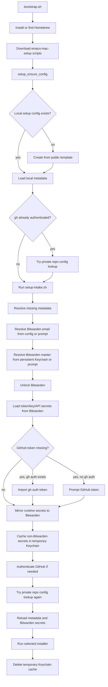

# Emacs Mac Setup

Automated Emacs setup for macOS. Four installation variants share a common configuration stored on GitHub. Org files are kept in sync with the beorg app on iPhone via iCloud.

---

## Quick Start

**Have these ready before you begin:**

- [ ] GitHub account + personal access token — Settings › Developer settings › Personal access tokens › Classic › scope: `repo`
- [ ] Bitwarden account for GitHub mode *(bootstrap installs the app/CLI; the master password is stored in macOS Keychain)*
- [ ] iCloud Drive enabled *(native variants only)*

**Everything else is automated:**

| What | How |
|---|---|
| Homebrew | Installed by `bootstrap.sh` if missing |
| GitHub CLI, git-crypt, Bitwarden CLI + desktop app | Installed by setup scripts |
| `GH_REPO` (private data repo) | Created by `bootstrap.sh` if it does not exist |
| Runtime secrets | Collected/imported up front; temporarily cached in Keychain; cleaned up after setup |
| Gemini API key | Default gptel backend; read from setup runtime into `~/.emacs.d/secrets.el` |
| XQuartz | Installed by `setup-emacs-docker-mac.sh` (Docker only) |

**Run in Terminal:**

```bash
# Download bootstrap and install the tested stable branch.
curl -fsSL https://raw.githubusercontent.com/deno1011/emacs-mac-setup/stable/bootstrap.sh -o bootstrap.sh
chmod +x bootstrap.sh
./bootstrap.sh stable

# Start Emacs after setup completes.
open "/Applications/Plus Emacs.app"                # Plus
open "/Applications/Yamamoto Emacs.app"            # Yamamoto
open "$HOME/Applications/GUI Docker Emacs.app"     # Docker
open "$HOME/Applications/GUI OrbStack Emacs.app"   # OrbStack
```

---

## GitHub Repos

**This repo** (belongs to `deno1011` — the shared template everyone uses):

| Repo | Visibility | Purpose |
|---|---|---|
| `deno1011/emacs-mac-setup` | public | All setup, uninstall, and utility scripts. Also: `init.el`, `config.org` (index), `core.org`, `org-setup.org`, `gptel-setup.org`, `setup-emacs-mac.conf.template` |

**Your repo** (created under your own GitHub account during bootstrap):

| Repo | Visibility | Purpose |
|---|---|---|
| `GH_REPO` (default: `emacs-data`) | private | Config files (`core.org`, `org-setup.org`, `gptel-setup.org`, `config.org`); org files; `emacs.d/secrets.el`. Encrypted with git-crypt. Cloned to iCloud Drive, synced to iPhone via beorg. `setup-emacs-mac.conf` is also stored here for bootstrap auto-pull. |

---

## Scripts

All scripts are downloaded to `~/emacs-mac-setup/` by `bootstrap.sh` — this is the default location when installed via the one-liner above. If you cloned the repo manually to a different path (e.g. `/tmp/emacs-mac-setup`), substitute that path in all commands below.
`setup-emacs-mac.conf` lives in `~/emacs-mac-setup/` after bootstrap.

### Config & Secrets

| Script | Purpose |
|---|---|
| `setup-emacs-mac.conf` | Personal config — pulled from private repo |
| `setup-emacs-mac.conf.template` | Fallback template if private repo not accessible |
| `init.el` | Emacs entry point — copied to `~/.emacs.d/init.el` |
| `config.org` | Emacs config index — entry point linking to the three config files below |
| `core.org` | Base config: UI, font, version control, protected files, auto-commit, startup sync |
| `org-setup.org` | Org mode: agenda, capture templates, tags, clocking, export, LaTeX |
| `gptel-setup.org` | AI assistant loader: installs `gptel-agent-runtime`, selects the default local model, and keeps setup-specific AI defaults small |
| `setup-intake.sh` | Up-front discovery, config repair, Bitwarden/Keychain unlock, and secret intake |
| `setup-doctor.sh` | Prints the last failed phase and concrete repair command |
| `fill-config.sh` | Compatibility wrapper for `setup-intake.sh` |
| `setup-bitwarden.sh` | Compatibility repair entry for Bitwarden-backed setup |
| `setup-secrets.sh` | Symlink `~/.emacs.d/secrets.el` -> repo file if decrypted; otherwise write keys from setup runtime |

### Install

| Script | Purpose |
|---|---|
| `setup-emacs-native-plus-mac.sh` | Install emacs-plus@30 (native comp, LSP) — thin wrapper |
| `setup-emacs-native-yamamoto-mac.sh` | Install emacs-mac@30exp (Yamamoto patches) — thin wrapper |
| `setup-emacs-native-mac.sh` | Shared implementation called by both native wrappers |
| `setup-emacs-docker-mac.sh` | Install Emacs in a Docker container (XQuartz) |
| `setup-emacs-orbstack-mac.sh` | Install Emacs in an OrbStack Linux machine (no XQuartz) |
| `bw-unlock.sh` | Compatibility Bitwarden API; delegates to `setup-lib.sh` and never prompts for API keys |

### Uninstall

| Script | Purpose |
|---|---|
| `uninstall-emacs-native-plus-mac.sh` | Remove emacs-plus |
| `uninstall-emacs-native-yamamoto-mac.sh` | Remove emacs-mac@30exp |
| `uninstall-emacs-docker-mac.sh` | Remove Docker variant |
| `uninstall-emacs-orbstack-mac.sh` | Remove OrbStack variant |

### Utilities

| Script | Purpose |
|---|---|
| `unlock-git-crypt.sh` | Decrypt org/ files in the iCloud repo |
| `remove-bitwarden-keychain.sh` | Delete Bitwarden master password from Keychain |

---

## Prerequisites

**System:**
- macOS 13 Ventura or newer
- iCloud Drive enabled (native variants store the repo in iCloud)

**Accounts:**
- GitHub account with a personal access token (Classic, `repo` scope)
- Bitwarden account

**Required config fields** (setup aborts with a repair command if empty when `GH_USER` is set):
`GIT_NAME` `GIT_EMAIL` `GH_REPO` `BW_FIELD` `BW_ITEM` `BW_GH_ITEM` `BW_ANTHROPIC_ITEM` `BW_GEMINI_ITEM` `BW_KEYCHAIN_SERVICE` `BITWARDEN_EMAIL`

Everything else — Homebrew, GitHub CLI, git-crypt, Bitwarden CLI, XQuartz, and all GitHub repos — is installed or created automatically by the setup scripts.

---

## Personal Config (`setup-emacs-mac.conf`)

Contains: name, email, GitHub username, Bitwarden item names, Docker names, and other non-secret setup metadata. It must not contain passwords, API keys, tokens, or git-crypt keys.

The setup source layout is:

1. `setup-emacs-mac.conf` stores non-secret metadata and Bitwarden item names.
2. macOS Keychain stores the Bitwarden master password persistently.
3. Bitwarden stores the GitHub token, git-crypt key, and API keys.
4. Setup temporarily caches Bitwarden-loaded secrets in Keychain under
   `emacs-mac-setup-runtime:*` so separate scripts can continue without
   prompting.
5. Successful installer endpoints delete that temporary Keychain cache again.

`MACOS_KEYCHAIN_ACCOUNT` is the macOS Keychain account name used for the stored
Bitwarden master-password entry.

`BITWARDEN_EMAIL` is the Bitwarden login email/username stored in the setup
config. `GITHUB_TOKEN`, `GIT_CRYPT_KEY`, `GEMINI_API_KEY`, and
`ANTHROPIC_API_KEY` are loaded from Bitwarden into memory by `setup-lib.sh`;
install scripts consume those runtime variables and do not open new password
prompts later.

The Bitwarden access data is the only persistent Keychain state: the master
password remains in Keychain, and the login email remains in config. GitHub
token, git-crypt key, Gemini key, and Anthropic key are not persisted in config
and are deleted from the temporary setup Keychain cache after setup.

**On a new Mac, bootstrap.sh handles the config automatically:**

- **GitHub already authenticated** (e.g. second Mac): pulls `setup-emacs-mac.conf` from private repo → ready immediately
- **Brand new Mac**: copies the template -> `setup-intake.sh` asks for missing setup data once, stores metadata in config, keeps the Bitwarden master password in Keychain, mirrors secrets to Bitwarden, then installation continues without scattered follow-up prompts

Order of precedence:

1. Existing local config is loaded first.
2. If GitHub is already authenticated, setup tries to pull the private repo config.
3. If no private config is available yet, setup uses the public template and prompts for missing metadata.
4. Bitwarden email comes from config or intake; the Bitwarden master password comes from persistent Keychain or intake.
5. Token/key/API secrets are imported from Bitwarden into the temporary setup Keychain cache.
6. After clone/install, a private repo config found in `config/setup-emacs-mac.conf` replaces the template metadata and secrets are reloaded from Bitwarden.

Bootstrap looks for your private config in a bounded set of known repo names:
the configured `GH_REPO` value, `emacs`, and `emacs-data`. It does not scan
every GitHub repo during discovery, so `Discover existing setup` stays fast. If
your private data repo has a different name, enter that `GH_REPO` value during
intake; setup retries the private config lookup after GitHub auth.

### Dependency Resolution Tree

The setup resolves data in this dependency order. Anything lower in the tree is
allowed to depend on everything above it; anything higher must not depend on
lower-level state.

```text
bootstrap.sh
`-- Homebrew
    `-- setup-lib.sh
        |-- public template config
        |   `-- creates local ~/emacs-mac-setup/setup-emacs-mac.conf when missing
        |-- local setup config
        |   |-- GIT_NAME
        |   |-- GIT_EMAIL
        |   |-- GH_USER
        |   |-- GH_REPO
        |   |-- Bitwarden item names
        |   `-- BITWARDEN_EMAIL
        |-- existing GitHub auth
        |   `-- optional early private repo config lookup
        |-- setup-intake.sh
        |   |-- prompts only for missing metadata
        |   |-- prompts Bitwarden email when config has none or repair bitwarden is requested
        |   |-- reads persistent Bitwarden master password from Keychain
        |   |-- prompts Bitwarden master password only when Keychain has none or repair bitwarden is requested
        |   |-- installs/unlocks Bitwarden
        |   |-- imports GitHub token from Bitwarden or existing gh auth
        |   |-- imports Gemini/Anthropic keys from Bitwarden
        |   |-- imports or generates git-crypt key
        |   |-- writes secrets to Bitwarden
        |   `-- writes non-Bitwarden secrets to temporary Keychain cache only
        |-- GitHub auth
        |   `-- uses existing gh auth or runtime GitHub token
        |-- private repo config lookup
        |   |-- replaces template/default metadata when available
        |   `-- reloads Bitwarden secrets after metadata changes
        `-- installer
            |-- native Emacs / Docker / OrbStack / secrets / git-crypt unlock
            |-- consumes runtime variables
            |-- never reads secrets from config
            `-- deletes temporary Keychain cache on exit
```



Scenario check:

| Scenario | Expected prompts | Source used |
|---|---|---|
| Local config complete, Bitwarden master in Keychain, Bitwarden has secrets | none for setup data | local config + Keychain + Bitwarden |
| Private repo config available because `gh auth` already exists | only missing Bitwarden access data if absent | private repo config + Keychain/Bitwarden |
| Fresh Mac, no `gh auth`, no local config | GitHub metadata, Bitwarden email, Bitwarden master, missing secrets | template first, private config after GitHub auth |
| Fresh Mac, no private repo yet | metadata and Bitwarden access data | template/local config + Bitwarden |
| Existing `gh auth`, GitHub token missing in Bitwarden | no token prompt | `gh auth token`, then mirror to Bitwarden |
| Bitwarden master already in Keychain | no Bitwarden password prompt | persistent Keychain |
| Temporary runtime Keychain entries left from failed setup | no duplicate prompt while retrying, then cleanup on installer exit | temporary Keychain cache |
| Old config contains accidental secret lines | ignored | Keychain/Bitwarden only |

---

## Emacs Variants

### 1. emacs-plus *(recommended for developers)*

- Emacs 30.2 with native compilation
- Packages compiled to native machine code — significantly faster LSP
- Native macOS fullscreen
- Install time: ~15–20 minutes

```bash
bash ~/emacs-mac-setup/setup-emacs-native-plus-mac.sh
```

Starts as: `/Applications/Plus Emacs.app`

### 2. emacs-mac — Yamamoto *(smooth rendering)*

- Emacs 30 with Yamamoto patches
- Pixel-perfect scrolling, better Retina rendering, native trackpad gestures
- Install time: ~15–25 minutes

```bash
bash ~/emacs-mac-setup/setup-emacs-native-yamamoto-mac.sh
```

Starts as: `/Applications/Yamamoto Emacs.app`

### 3. Docker *(isolated, XQuartz)*

- Emacs runs in a Docker container, config pulled from GitHub on start
- Display via XQuartz — clipboard image paste not supported
- Only the beorg iCloud folder is mounted — no Mac filesystem exposure

```bash
bash ~/emacs-mac-setup/setup-emacs-docker-mac.sh
```

App bundles in `~/Applications/`:
- `GUI Docker Emacs.app` — graphical Emacs via XQuartz
- `Console Docker Emacs.app` — Emacs in terminal (`-nw`)
- `Shell Docker Emacs.app` — shell inside the container
- `Root Shell Docker Emacs.app` — root shell inside the container

### 4. OrbStack *(isolated, no XQuartz)*

- Emacs runs in an OrbStack Linux machine (Ubuntu 24.04)
- No XQuartz needed — OrbStack handles display natively on macOS 14+
- Mac home directory accessible in the machine → clipboard image paste works
- Requires OrbStack (`brew install --cask orbstack`)

```bash
bash ~/emacs-mac-setup/setup-emacs-orbstack-mac.sh
```

App bundles in `~/Applications/`:
- `GUI OrbStack Emacs.app` — graphical Emacs
- `Console OrbStack Emacs.app` — Emacs in terminal (`-nw`)
- `Shell OrbStack Emacs.app` — shell inside the machine
- `Root Shell OrbStack Emacs.app` — root shell inside the machine

---

## Starting Emacs

**Native (Plus / Yamamoto):**

```bash
open "/Applications/Plus Emacs.app"
open "/Applications/Yamamoto Emacs.app"
# or via Spotlight — type "Emacs"
emacs -nw   # TUI mode
```

**Docker:** Double-click one of the app bundles in `~/Applications/`, or use Spotlight.

**OrbStack:** Double-click one of the app bundles in `~/Applications/`, or run `emacs-orb` in the terminal (after reloading shell: `source ~/.zshrc`).

---

## What Not To Do

**Two native instances at the same time:**  
emacs-plus and emacs-mac@30exp share `~/.emacs.d/` and the same iCloud repo (`~/Library/Mobile Documents/com~apple~CloudDocs/<GH_REPO>/`). Running both simultaneously causes lock file collisions and git-auto-commit-mode writing to the same repo concurrently.

**Native and Docker at the same time:**  
Both use the same GitHub repo. Concurrent edits lead to git conflicts on the next sync.

**`emacs` in the terminal while a GUI instance is running:**  
The Homebrew wrapper starts a second instance with the same config.

---

## beorg iPhone Setup

**One-time configuration in the beorg app:**

1. Open beorg on iPhone
2. Tap the **gear icon** (Settings) → **Files**
3. Set **Directory** to: `iCloud Drive → beorg → Documents → org`
   - This is the folder beorg creates automatically on first launch
   - On Mac the full path is: `~/Library/Mobile Documents/iCloud~com~appsonthemove~beorg/Documents/org/`
4. Tap **Done**

The setup scripts sync the repo's `org/` folder to that path automatically. beorg picks up changes via iCloud within seconds.

> If the `org/` folder is empty on first launch (fresh repo), beorg will show no files — that is expected. Add or commit an `.org` file in Emacs and it will appear in beorg after the next sync.

---

## beorg Sync

```
GitHub (source of truth)
     │
     │ git pull / push
     │
Native Emacs        Docker Emacs       OrbStack Emacs
     │                   │                   │
on startup:         startup-sync.sh    startup-sync.sh
  git pull + revert      │                   │
  rsync → beorg          │                   │
     │                   │                   │
post-commit hook    post-commit hook   post-commit hook
     │                   │                   │
beorg iCloud folder ◄────┴───────────────────┘
     │
iPhone (beorg app)
```

**Native (Plus / Yamamoto):**  
On startup, `my/startup-sync` runs in the background:
1. `git pull --ff-only origin main`
2. Reverts all open org buffers so the agenda reflects the latest content
3. Syncs `org/` to `~/Library/Mobile Documents/.../beorg/Documents/org/`

After every save, `git-auto-commit-mode` commits and a post-commit hook pushes to GitHub and re-syncs beorg.

**Docker:**  
`startup-sync.sh` runs when the container starts:
1. `git clone` if repo not yet in container, then `git pull origin main`
2. `rsync org/ → /beorg/` (the mounted beorg iCloud folder)

A post-commit hook inside the container repeats the rsync and pushes after each commit.

| Side | Path |
|---|---|
| Mac | `~/Library/Mobile Documents/.../beorg/org/` |
| Container | `/beorg/` |

---

## Docker Specifics

- **Volume `emacs-home`:** persistent Emacs packages (`~/.emacs.d/`) survive container restarts without living on the Mac
- **Config:** via `git clone/pull` to `~/<GH_REPO>/` inside the container — not a bind-mount
- **Only one bind-mount:** the beorg folder for iPhone sync

**Container management:**

```bash
docker ps                   # check running containers
docker start emacs-dev      # start manually
docker logs emacs-dev       # view logs
```

---

## Parallel Installation (Plus + Yamamoto)

Both variants can coexist in the Homebrew Cellar:
- Each has its own app icon in `/Applications/`
- Only one is active via the `emacs` command in the terminal (the most recently linked one)
- Each setup script automatically links its own version and unlinks the other

When uninstalling one variant while the other is still installed, shared resources (`~/.emacs.d/`, iCloud repo, packages) are preserved and the remaining variant is automatically linked.

---

## Fresh Repo (for friends / first-time setup)

Starting with an empty private repo is fine:

| Situation | Result |
|---|---|
| `git clone` on empty repo | OK |
| `git-crypt unlock` fails | Warning only — not an error |
| Config files missing | `config.org`, `core.org`, `org-setup.org`, `gptel-setup.org` copied automatically from bundled copies |
| `org/` folder missing | beorg hook runs empty — no crash |

A friend only needs their own GitHub account and Bitwarden account — no access to your git-crypt key or org files needed.

---

## GitHub Mode vs Local Mode

**`GH_USER` set:**  
Full setup — Bitwarden auth, GitHub auth, iCloud clone, git-crypt unlock, post-commit hook, beorg sync.

**`GH_USER` empty:**  
Local mode — no Bitwarden, no GitHub, no iCloud. `config.org` is copied locally. Emacs starts fully configured. Good for offline or trial use. Add `GH_USER` later and re-run to enable full sync.

---

## Installed Packages

### Native (emacs-plus and Yamamoto) — Mac-side

Installed via Homebrew by `setup-emacs-native-{plus,yamamoto}-mac.sh`:

| Package | When | Purpose |
|---|---|---|
| `emacs-plus@30` / `emacs-mac@30exp` | always | Emacs itself |
| `bitwarden-cli` | GitHub mode | Vault import/mirroring during intake and recovery |
| `gh` | GitHub mode | GitHub CLI (repo clone, auth, API) |
| `git-crypt` | GitHub mode | Encrypt/decrypt org files in the repo |

Additional tools (LaTeX, ripgrep, aspell, etc.) are installed by `core.org` on first Emacs launch — see [core.org-installed packages](#coreorg-installed-packages) below.

### Docker — Mac-side

Installed via Homebrew by `setup-emacs-docker-mac.sh`:

| Package | Purpose |
|---|---|
| `docker` | Docker CLI |
| `colima` | Lightweight Docker runtime for macOS |
| `bitwarden-cli` | Secret retrieval |
| `gh` | GitHub CLI |
| `git-crypt` | Repo encryption |
| XQuartz | X11 display server for GUI Emacs (installed via `sudo installer`, prompts for admin password once) |

### Docker — Inside the container (Ubuntu)

Built into the Docker image via `apt-get` and `npm`:

| Package | Purpose |
|---|---|
| `emacs-lucid` | Emacs with X11 GUI |
| `texlive`, `texlive-latex-extra`, `texlive-fonts-recommended`, `texlive-science` | LaTeX and math preview |
| `dvipng`, `imagemagick` | LaTeX fragment rendering in org |
| `aspell`, `aspell-de`, `aspell-en` | Spell checking |
| `ripgrep` | Fast text search |
| `python3`, `python3-pip` | Python runtime |
| `nodejs` (v20) | JavaScript runtime |
| `@anthropic-ai/claude-code` | Claude Code CLI |
| `fonts-jetbrains-mono` | Editor font |
| `git`, `git-crypt`, `curl`, `wget`, `build-essential` | Dev tooling |

### OrbStack — Mac-side

Installed via Homebrew by `setup-emacs-orbstack-mac.sh`:

| Package | Purpose |
|---|---|
| `orbstack` (cask) | OrbStack app — VM runtime and display server |

### OrbStack — Inside the VM (Ubuntu)

Installed via `apt-get` and `npm` inside the OrbStack Linux machine:

| Package | Purpose |
|---|---|
| `emacs-lucid` | Emacs with X11 GUI |
| `texlive`, `texlive-latex-extra`, `texlive-fonts-extra`, `texlive-science` | LaTeX and math preview |
| `dvipng`, `imagemagick` | LaTeX fragment rendering in org |
| `gnuplot` | Plot generation via org-babel |
| `r-base` | R language via org-babel |
| `graphviz`, `plantuml` | Diagram rendering via org-babel |
| `aspell`, `aspell-de`, `aspell-en` | Spell checking |
| `ripgrep` | Fast text search |
| `python3`, `python3-pip` | Python runtime |
| `nodejs`, `npm` | JavaScript runtime |
| `@anthropic-ai/claude-code` | Claude Code CLI |
| JetBrains Mono font | Monospace editor font (downloaded from GitHub releases) |
| `git`, `git-crypt`, `curl`, `wget`, `unzip`, `xclip`, `fontconfig` | Dev tooling |

### core.org-installed packages

Installed at first Emacs launch on **native variants only** (tracked in `~/.emacs.d/system-packages.log`). Docker and OrbStack have equivalent packages pre-installed in their container/VM.

**brew:**

| Package | Purpose |
|---|---|
| `gnuplot` | Plot generation via org-babel |
| `r` | R language support via org-babel |
| `graphviz` | Dot/graph diagrams via org-babel |
| `plantuml` | UML diagrams via org-babel |
| `mermaid-cli` | Mermaid diagrams via org-babel |
| `texlive` | LaTeX rendering and math preview |
| `pngpaste` | Paste images into org buffers |
| `aspell` | Spell checking |
| `font-jetbrains-mono` | Editor font (cask) |

**pip:**

| Package | Purpose |
|---|---|
| `matplotlib` | Python plots and math function graphs |
| `numpy` | Numerical computing for Python babel blocks |

The uninstall scripts read `system-packages.log` and remove all tracked packages (brew and pip). Use `--ask` to be prompted before each removal.

---

## Apple Reminders Integration

Bidirectional sync between Emacs/Org and macOS Apple Reminders lives in its
own package, **[`org-apple-reminders`](https://github.com/deno1011/org-apple-reminders)**.
It is installed automatically by `org-apple-reminders-setup.org` on first
Emacs start (via `package-vc-install` from the package's `main` branch) and
silently updated in the background each Emacs startup.

For full documentation — features, key bindings (`C-c r p`, `C-c r m`,
`C-c r d`, `C-c r D`, `C-c r R`, `C-c r i`, …), configuration, the
`C-c c A` capture template, the two-timestamp conflict-resolution model,
and troubleshooting — see the
[`org-apple-reminders` README](https://github.com/deno1011/org-apple-reminders#readme).

The package runs entirely via JXA (`osascript`); no external CLI tools are
required. `C-c r R` triggers a full bidirectional sync.

---

## AI Integration

The configuration includes a local-first AI assistant inside Emacs via
**gptel** and the standalone
[`gptel-agent-runtime`](https://github.com/deno1011/gptel-agent-runtime)
package. The setup repo keeps only installation and local defaults; the runtime
package owns tools, directives, memory, tracing, routing, and agent behavior.

### Backends

Multiple AI backends are pre-configured and switchable with `C-c M`:

| Backend | Models |
|---|---|
| **Gemini** | Gemini 2.0 Flash is the startup default when `GEMINI_API_KEY` is available |
| **Ollama** | Optional local backend; configured automatically when Ollama is installed |
| **Claude** (Anthropic) | Opus 4.7, Sonnet 4.6, Haiku 4.5 |
| **ChatGPT** (OpenAI) | GPT-4o, GPT-4o-mini, o3-mini, o4-mini |
| **LM Studio** | Any local model loaded in LM Studio |

API keys are stored in Bitwarden, loaded into process memory by setup scripts, and written to `secrets.el` for Emacs startup.

### Executable Responses and Tools

The assistant can act on Emacs state silently via gptel tools, or produce visible
Org Babel code blocks that are rendered inline:

| Method | What happens |
|---|---|
| `run_elisp` tool | Claude calls it silently — Emacs action executes, no code block appears in the buffer |
| `` #+begin_src elisp :AUTORUN `` | Executed immediately — code block visible; runs any Emacs command, edits buffers, opens files |
| `` #+begin_src python/R/gnuplot :results output `` | Executed via org-babel, output inserted inline |
| `` #+begin_src python/R/gnuplot :file name.png `` | Executed and result displayed as an inline image |
| `` #+begin_src sh :results output `` | Shell command executed, output inserted |

This means you can ask the assistant to "add a TODO to inbox.org", "plot sin(x)
from 0 to 2 pi", or "set the font size to 14" and it can do the work directly,
subject to the runtime safety policy.

### Graph and Diagram Generation

Supported renderers for inline output:

| Tool | Output |
|---|---|
| Python + matplotlib | 2D/3D plots, data visualisations |
| gnuplot | Function plots, data graphs |
| R | Statistical plots |
| graphviz (dot) | Dependency and flow graphs |
| mermaid | Sequence diagrams, flowcharts |
| plantuml | UML diagrams |
| LaTeX / dvipng | Inline math, rendered equations |

All diagrams appear inline in the org buffer after Claude responds — no external viewer needed.

### Org-mode Tools

The assistant has access to live Emacs state via gptel tools:

| Tool | What it does |
|---|---|
| `get_todos` | Reads all open TODO entries from the org agenda |
| `read_org_file` | Reads any org file by path |
| `write_org_file` | Overwrites an org file (protected files blocked) |
| `add_todo` | Appends a new TODO heading to an org file |
| `change_todo_state` | Changes the state of a TODO entry (e.g. TODO → DONE) |
| `set_deadline` | Sets or updates the DEADLINE on a TODO entry |
| `add_tag` | Adds a tag to a heading |
| `get_org_structure` | Returns the heading outline of an org file |
| `execute_code` | Runs a code block (Python, R, shell, etc.) via org-babel |
| `run_elisp` | Evaluates Elisp and performs Emacs actions silently (no code block in buffer) |
| `read_file` | Reads any plain-text file |
| `write_file` | Writes a plain-text file (protected files blocked) |
| `list_directory` | Lists files and directories at a given path |
| `search_files` | Full-text search across files (ripgrep) |
| `list_buffers` | Lists all currently open Emacs buffers |
| `get_buffer_content` | Returns the content of an open buffer |
| `org_export` | Exports an org file to PDF, HTML, or other formats |

`run_elisp` is the primary tool for silent Emacs actions. Combined with the
other tools, the assistant can query tasks, reason about them, and update org
files in one interaction when policy allows it.

### LaTeX in Responses

LaTeX fragments in assistant responses are rendered automatically as math images
in the org buffer after each reply — no manual `M-x org-latex-preview` needed.

### Local Models

Gemini is the default startup backend because it works on fresh Macs without a
local model download. Ollama remains available as an optional local backend:
install Ollama and pull a model when you want fully local inference. LM Studio
or any OpenAI-compatible local server can still be selected as a backend.

---

## Uninstall

```bash
bash ~/emacs-mac-setup/uninstall-emacs-native-plus-mac.sh       # remove emacs-plus
bash ~/emacs-mac-setup/uninstall-emacs-native-yamamoto-mac.sh   # remove emacs-mac@30exp
bash ~/emacs-mac-setup/uninstall-emacs-docker-mac.sh            # remove Docker variant
bash ~/emacs-mac-setup/uninstall-emacs-orbstack-mac.sh          # remove OrbStack variant

bash ~/emacs-mac-setup/remove-bitwarden-keychain.sh             # remove Bitwarden master password from Keychain
```

> The Bitwarden Keychain entry is **not** deleted by the uninstall scripts (it is shared). Remove it explicitly with the script above after all variants have been uninstalled.

### `--ask` flag

Pass `--ask` to be prompted before each brew package is removed. Useful when a package (e.g. `ripgrep`) is also used outside Emacs and you want to keep it:

```bash
bash ~/emacs-mac-setup/uninstall-emacs-native-plus-mac.sh --ask
bash ~/emacs-mac-setup/uninstall-emacs-native-yamamoto-mac.sh --ask
bash ~/emacs-mac-setup/uninstall-emacs-docker-mac.sh --ask
```

Without `--ask`, all packages installed by the setup are removed automatically.

---

## git-crypt

The `org/` files and `emacs.d/secrets.el` in the GitHub repo are encrypted with git-crypt. The key is stored in Bitwarden (`emacs-git-crypt-key`, field: `Key`).

After `git-crypt unlock`, setup scripts automatically symlink `~/.emacs.d/secrets.el` to the decrypted repo file. If the repo file is missing or still encrypted, `setup-secrets.sh` writes a local `secrets.el` from the already-loaded setup runtime.

**Manual unlock:**

```bash
bash ~/emacs-mac-setup/unlock-git-crypt.sh
```

Setup scripts unlock automatically — on first clone and on every subsequent run if the org files are found encrypted.

---

## Theme

All variants use **modus-vivendi** — built into Emacs 28+, designed for high contrast and readability (WCAG AAA standard).

---

## Development

This section is for the repo owner testing changes before promoting them to `stable`.

### Branch structure

| Branch | Purpose |
|---|---|
| `stable` | What new users get via bootstrap. Always a known-good state. |
| `main` | Active development. May contain untested changes. |
| `session-YYYY-MM-DD-working` | Tags marking the last known-good commit of a session. Used for rollback. |

### Reinstall from `stable` (new-user path)

```bash
curl -fsSL https://raw.githubusercontent.com/deno1011/emacs-mac-setup/stable/bootstrap.sh -o bootstrap.sh
chmod +x bootstrap.sh
./bootstrap.sh stable
```

Bootstrap downloads all scripts from `stable`, runs the up-front intake,
configures Bitwarden + GitHub auth when requested, installs emacs-plus, and
prepares Gemini as the default gptel backend when a Gemini key is available.

### Reinstall from `main` (dev/testing path)

Each branch's `!STARTHERE.md` should pass its own branch to `bootstrap.sh`.
`bootstrap.sh` still defaults to `stable` when no branch is provided, but branch
testing should be explicit:

```bash
curl -fsSL https://raw.githubusercontent.com/deno1011/emacs-mac-setup/main/bootstrap.sh -o bootstrap.sh
chmod +x bootstrap.sh
./bootstrap.sh main
```

Any feature branch can be tested the same way:

```bash
curl -fsSL https://raw.githubusercontent.com/deno1011/emacs-mac-setup/feature/my-branch/bootstrap.sh -o bootstrap.sh
chmod +x bootstrap.sh
./bootstrap.sh feature/my-branch
```

### Session tags and rollback

After every working session, tag the last known-good commit:

```bash
git tag session-YYYY-MM-DD-working
git push origin session-YYYY-MM-DD-working
```

Rollback the whole repo:

```bash
git reset --hard session-YYYY-MM-DD-working
```

Restore a single file from a tag:

```bash
git checkout session-YYYY-MM-DD-working -- config.org
```

### Promoting `main` → `stable`

Once changes are tested:

```bash
git checkout stable
git merge main --no-edit
git push origin stable
git checkout main
```
